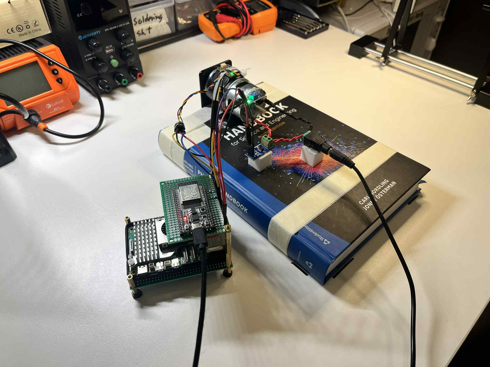
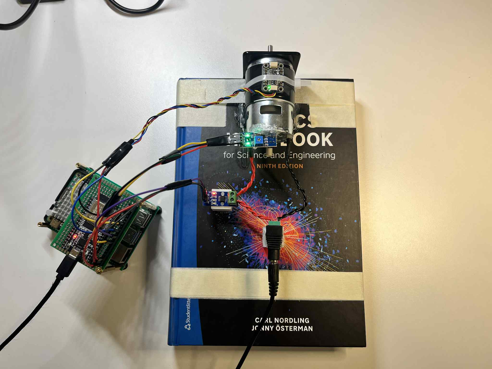
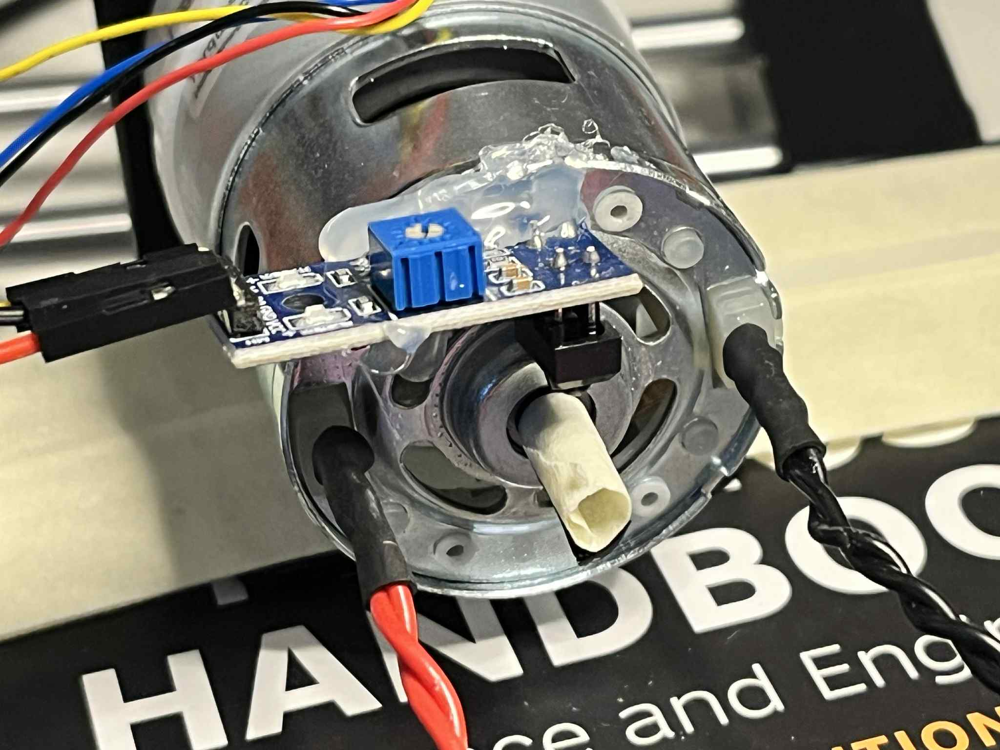
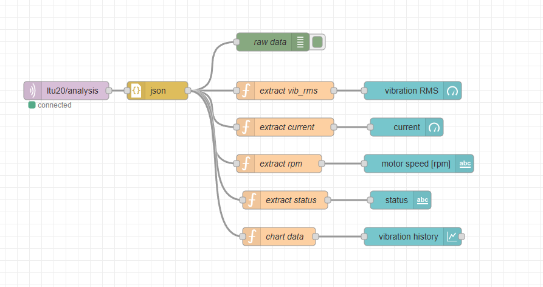
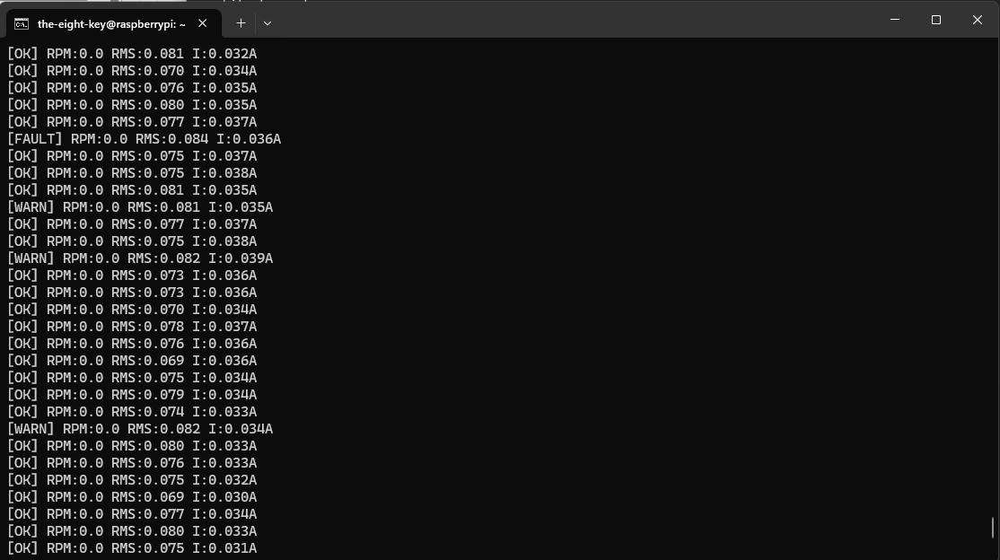
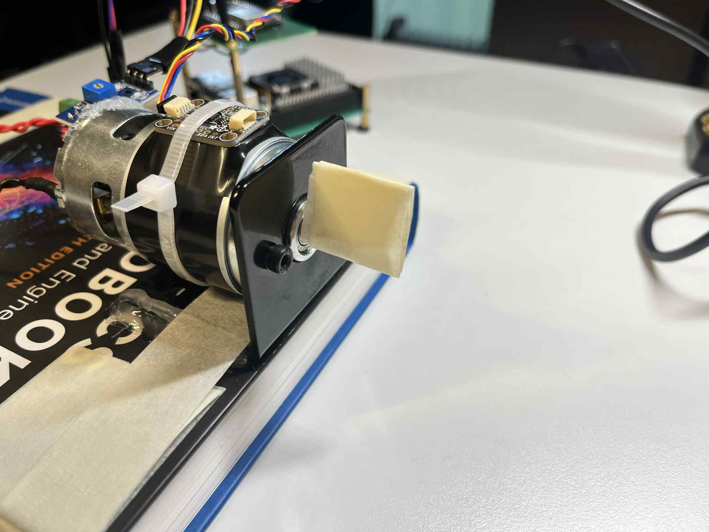

# 775-Condition-Monitoring

End-to-end condition monitoring prototype for a 775 12V DC motor using vibration + current + RPM signals.  
Pipeline: ESP32 -> Raspberry Pi 5 -> MQTT -> Node-RED dashboard.

Full presentation: **[docs/Motor_CM.pdf](docs/Motor_CM.pdf)**

## Photos

## Node-RED dashboard + pipeline

## Raspberry Pi live output

